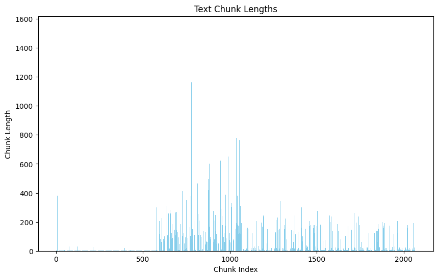
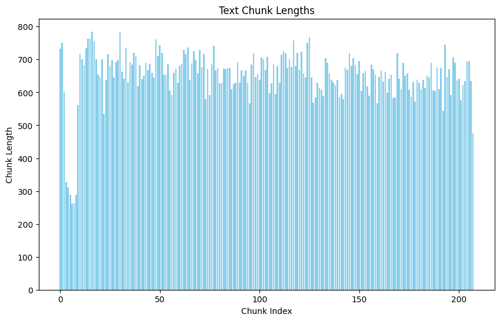
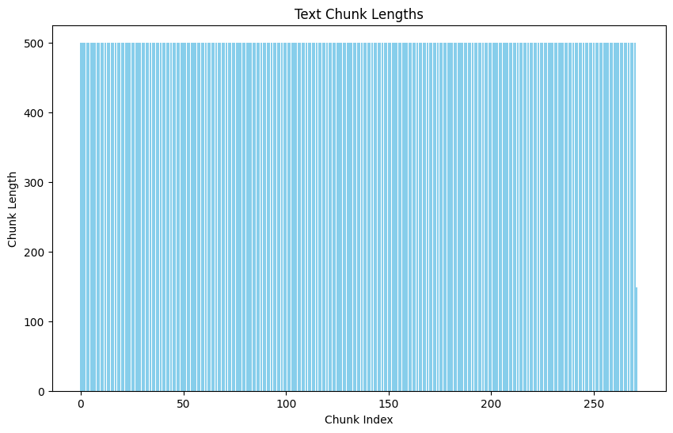
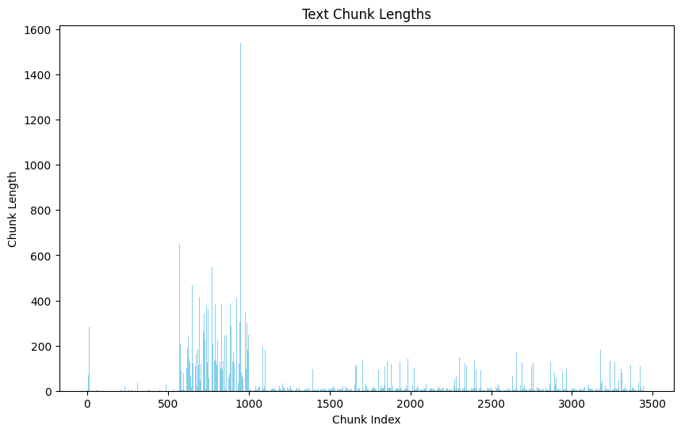
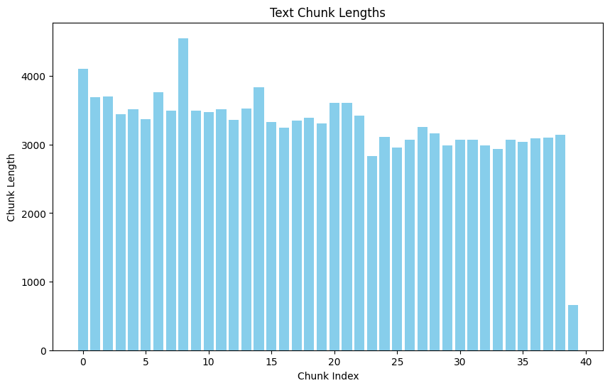

# Table of Contents
- [Table of Contents](#table-of-contents)
- [Overview](#overview)
- [Setup](#setup)
  - [Prerequisites](#prerequisites)
  - [Installation](#installation)
- [Project Structure](#project-structure)
- [LLM Class Documentation](#llm-class-documentation)
  - [Supported Models](#supported-models)
  - [Initialization](#initialization)
  - [Methods](#methods)
  - [Usage Example](#usage-example)
  - [Notes](#notes)
- [Comparison of Large Language Models](#comparison-of-large-language-models)
  - [Overview](#overview-1)
  - [Comparison Table](#comparison-table)
  - [Overview of Model Characteristics](#overview-of-model-characteristics)
- [Collection Class Documentation](#collection-class-documentation)
  - [Initialization](#initialization-1)
  - [Methods](#methods-1)
  - [Usage Example](#usage-example-1)
  - [Notes](#notes-1)
- [Summarizer Class Documentation](#summarizer-class-documentation)
  - [Supported Models](#supported-models-1)
  - [Initialization](#initialization-2)
  - [Methods](#methods-2)
  - [Usage Example](#usage-example-2)
  - [Notes](#notes-2)
- [PDF Text Extraction Function Documentation](#pdf-text-extraction-function-documentation)
  - [Function Definition](#function-definition)
  - [Usage Example](#usage-example-3)
  - [Notes](#notes-3)
- [TextPreProcessor Class Documentation](#textpreprocessor-class-documentation)
  - [Initialization](#initialization-3)
  - [Methods](#methods-3)
  - [Usage Example](#usage-example-4)
  - [Notes](#notes-4)
- [Comparison of Different Text Processing Methods](#comparison-of-different-text-processing-methods)
  - [Overview](#overview-2)
  - [Comparison Plots](#comparison-plots)
  - [Conclusion](#conclusion)
- [RAG Class Documentation](#rag-class-documentation)
  - [Initialization](#initialization-4)
  - [Methods](#methods-4)
  - [Usage Example](#usage-example-5)
  - [Notes](#notes-5)
- [Comparison of different EFs with different LLMs in RAG Class](#comparison-of-different-efs-with-different-llms-in-rag-class)
  - [Overview](#overview-3)
  - [Comparison Table](#comparison-table-1)
  - [Usage Examples and Observations](#usage-examples-and-observations)
  - [Summary](#summary)

# Overview
This project is designed to demonstrate the use of various NLP (Natural Language Processing) models for text generation, summarization, and information retrieval. It utilizes models from Hugging Face's Transformers library and integrates with ChromaDB for efficient context retrieval. The project includes classes and methods for:
1. Loading and using different language models (LLMs) like GPT-2, T5, BERT, GPT-Neo, and others.
2. Generating text based on input queries and context.
3. Summarizing large text documents.
4. Extracting and processing text from PDF files.
5. Storing and retrieving context data using a vector database.

# Setup

## Prerequisites
Ensure you have Python installed on your system. This project requires the following Python packages:
- chromadb
- sentence-transformers
- pymupdf
- huggingface_hub
- transformers
- torch
- matplotlib
- nltk

## Installation
1. Clone the repository or download the project files.
2. Install the required packages:
```bash
pip install -r requirements.txt
```

# Project Structure
- `main.ipynb`: Main Jupyter notebook containing the project code.
- `models/`: Directory to store downloaded and saved models.
- `tests/`: Directory containing test PDF files.


# LLM Class Documentation

**Class Overview**  
The `LLM` class provides a flexible interface for loading, managing, and utilizing various large language models (LLMs) such as GPT-2, T5, BERT, and others. This class handles device selection, model loading, and memory management, allowing for both online and offline model usage.

## Supported Models
The `LLM` class currently supports the following models:

- GPT-2
- T5
- BERT
- DistilBERT
- GPT-Neo
- Gemma

`model_classes`  
A dictionary mapping LLM types to their respective tokenizer class, model class, and model path.

## Initialization

```python
LLM(llm_type: str, load_online=False, save_model=False)
```

- **`llm_type`**: The type of language model to load (e.g., 'gpt2', 't5').
- **`load_online`**: If `True`, the model is loaded from an online source (e.g., Hugging Face Hub). If `False`, the model is loaded from a local directory.
- **`save_model`**: If `True`, the loaded model and tokenizer are saved to the local direc## tory.

## Methods

**`load_llm`**

Loads the specified language model and tokenizer.

```python
load_llm(llm_type: str, load_online: bool, save_model: bool)
```

- `llm_type`: Type of LLM to load.  
- `load_online`: If `True`, loads the model from an online source.  
- `save_model`: If `True`, saves the model and tokenizer locally.

**Returns**: A tuple containing the loaded tokenizer and model.

---

**`select_device`**

Selects the appropriate device for running the model ('cuda' if GPU is available, otherwise 'cpu').

```python
@staticmethod
select_device() -> str
```

**Returns**: A string indicating the device ('cuda' or 'cpu').

---

**`generate_text`**

A placeholder method to be implemented by subclasses for generating text based on input.

```python
generate_text(input_text: str, context: str = '') -> str
```

- `input_text`: The input text for the model.
- `context`: Optional context for text generation.

**Raises**: `NotImplementedError`

---

**`free_memory`**

Frees up memory by deleting the model and tokenizer and clearing the cache.

```python
free_memory()
```

## Usage Example

Here's a step-by-step example of how to use the `LLM` class:

1. Initialize the Model & Implement the generate_text function:
    ```python
    class GPT2(LLM):
        def __init__(self, load_online=False, save_model=False):
            super().__init__('gpt2', load_online, save_model)
            self.max_length = 1024

        def generate_text(self, input_text: str, context: str = '') -> str:
            max_context_length = self.max_length - len("Context: \nQuestion: \nAnswer:")
            context = context[:max_context_length]

            prompt = f"Context: {context}\nQuestion: {input_text}\nAnswer:"

            inputs = self.tokenizer.encode(prompt, return_tensors='pt').to(self.device)
            outputs = self.model.generate(
                inputs,
                max_new_tokens=150,
                temperature=0.7,
                top_p=0.9,
                top_k=50,
                num_return_sequences=1,
                pad_token_id=self.tokenizer.eos_token_id,
                do_sample=True
            )

            response = self.tokenizer.decode(outputs[0], skip_special_tokens=True)
            response = response.replace(prompt, '').strip()
            return response.split('\n')[0]

    ```

2. Generate Text

    ```python
    llm = GPT2()
    question = "What is the capital of Iran?"
    context = 'some text ...'
    output = llm.generate_text(question, context)
    print(output)
    ```

3. Free Memory

    ```python
    llm.free_memory()
    ```

## Notes

- **Model Classes**: The `model_classes` dictionary maps LLM types to their respective tokenizer class, model class, and model path, ensuring the correct components are loaded for each model type.
- **Initialization**: The constructor (`__init__`) sets up the device, loads the specified model and tokenizer, and optionally saves the model locally.
- **Device Selection**: The `select_device` method automatically selects 'cuda' if a GPU is available, otherwise defaults to 'cpu'.
- **Text Generation**: The `generate_text` method is a placeholder and should be implemented by subclasses to define specific text generation behavior.
- **Memory Management**: The `free_memory` method helps manage memory by cleaning up model and tokenizer instances and clearing the GPU cache if necessary.

By following these steps and methods, you can effectively manage and utilize various large language models for different natural language processing tasks.

# Comparison of Large Language Models

## Overview
The `LLM` class supports a range of large language models, each tailored for specific natural language processing tasks. This comparison provides an overview of different models, their unique characteristics, typical use cases, and effectiveness, helping you choose the right model for your needs.

## Comparison Table

| Model         | Description                                                                 | Use Case                                           | Effectiveness      |
|---------------|-----------------------------------------------------------------------------|----------------------------------------------------|--------------------|
| `gpt2`        | GPT-2 is an open-source language model developed by OpenAI with a 1.5 billion parameter version available. | Suitable for general-purpose text generation       | High               |
| `t5`          | T5 (Text-to-Text Transfer Transformer) converts all NLP tasks into a text-to-text format. | Excellent for translation, summarization, and Q&A  | High               |
| `bert`        | BERT (Bidirectional Encoder Representations from Transformers) is designed to pre-train deep bidirectional representations. | Best for question answering and text classification | High               |
| `distil-bert` | A smaller, faster, cheaper version of BERT that retains 97% of its language understanding capabilities. | Ideal for applications requiring faster inference  | Medium             |
| `gpt-neo`     | An open-source model developed by EleutherAI, comparable to GPT-3 in terms of architecture. | Great for large-scale text generation and completion | High               |
| `gemma`       | A state-of-the-art model developed by Google, designed for efficient large-scale language tasks. | Best for complex and high-accuracy requirements    | High               |
| `llama`       | A variant optimized for efficiency and speed, developed by OpenBMB.        | Ideal for tasks requiring quick responses          | Medium             |
| `textbase`    | A model designed for foundational text understanding and generation tasks. | Good for foundational NLP tasks                    | Medium             |

## Overview of Model Characteristics
- **GPT-2**: Known for its robust performance in general text generation tasks. It is widely used for applications such as text completion and story generation.
- **T5**: This versatile model excels in tasks that can be framed as text-to-text transformations, including translation, summarization, and question answering.
- **BERT**: A powerful model for tasks that require deep understanding of text, like question answering and text classification.
- **DistilBERT**: Provides a good balance between performance and speed, making it suitable for applications where inference time is critical.
- **GPT-Neo**: Offers capabilities similar to GPT-3 and is suitable for generating large amounts of text and completing complex text inputs.
- **Gemma**: Optimized for high-accuracy requirements and complex tasks, it is ideal for advanced NLP applications.
- **Llama**: Focuses on efficiency and speed, making it a good choice for applications that need quick responses.
- **TextBase**: A foundational model useful for a broad range of basic NLP tasks.

This comprehensive comparison aids in selecting the most suitable large language model based on specific requirements and application contexts.

# Collection Class Documentation

**Class Overview**  
The `Collection` class provides an interface for creating and managing a collection of documents with vector embeddings, utilizing a transformer model for encoding text data. This class integrates with ChromaDB to add and retrieve contexts efficiently.

## Initialization

```python
Collection(collection_name: str, transformer_type: str = 'all-MiniLM-L6-v2', load_online=False, save_transformer=False)
```

- **`collection_name`**: The name of the collection to create or use.
- **`transformer_type`**: The type of transformer model to use for encoding (default is 'all-MiniLM-L6-v2').
- **`load_online`**: If `True`, the transformer model is loaded from an online source. If `False`, the model is loaded from a local directory.
- **`save_transformer`**: If `True`, the transformer model is saved to the local directory.

## Methods


**`load_sentence_transformer`**

Loads the specified sentence transformer model.

```python
load_sentence_transformer(transformer_type: str, load_online: bool, save_transformer: bool)
```

- **`transformer_type`**: Type of transformer model to load.
- **`load_online`**: If `True`, loads the model from an online source.
- **`save_transformer`**: If `True`, saves the model locally.

**Returns**: The loaded sentence transformer model.

---

**`add_contexts`**

Adds context documents to the collection with vector embeddings.

```python
add_contexts(context_data: list)
```

- **`context_data`**: A list of context documents to add to the collection.

---

**`retrieve_contexts`**

Retrieves the most relevant context documents based on a query.

```python
retrieve_contexts(question: str, top_n: int = 1)
```

- **`question`**: The query for which to find relevant context documents.
- **`top_n`**: The number of top results to retrieve (default is 1).

**Returns**: A list of the top `n` most relevant context documents.

---

## Usage Example

Here's a step-by-step example of how to use the `Collection` class:

1. Initialize the Collection:

    ```python
    collection = Collection('rag')
    ```

2. Add Contexts to the Collection:

    ```python
    context_data = [
        "The capital of France is Paris. It is known for its art, culture, and cuisine.",
        "The Great Wall of China is one of the greatest wonders of the world.",
        "The Amazon rainforest is a moist broadleaf forest that covers most of the Amazon basin of South America.",
        "The Amazon rainforest is a moist broadleaf forest that covers most of the Amazon basin of South Asia."
    ]
    collection.add_contexts(context_data)
    ```

3. Retrieve Relevant Contexts:

    ```python
    response = collection.retrieve_contexts('amazon', top_n=2)
    print(response)
    ```

## Notes

- **Initialization**: The constructor checks if the specified collection exists and deletes it if it does before creating a new collection.
- **Loading Transformers**: The `load_sentence_transformer` method handles both online and offline loading of the transformer model, and optionally saves the model locally.
- **Adding Contexts**: The `add_contexts` method encodes the context data into vectors and adds them to the collection with unique IDs.
- **Retrieving Contexts**: The `retrieve_contexts` method queries the collection with a vectorized question and retrieves the most relevant documents.

By following these steps and methods, you can effectively manage and utilize a collection of context documents with vector embeddings for various applications.


# Summarizer Class Documentation

**Class Overview**  
The `Summarizer` class provides a flexible interface for loading, managing, and utilizing various text summarization models such as T5, BART, and Pegasus. This class handles device selection, model loading, and memory management, allowing for both online and offline model usage.

## Supported Models
The `Summarizer` class currently supports the following models:

- T5
- BART
- Pegasus

`summarizer_models`  
A dictionary mapping summarizer model types to their respective tokenizer class, model class, and model path.

## Initialization

```python
Summarizer(summarizer_model: str = 't5', load_online=False, save_model=False)
```

- **`summarizer_model`**: The type of summarizer model to load (e.g., 't5', 'bart').
- **`load_online`**: If `True`, the model is loaded from an online source (e.g., Hugging Face Hub). If `False`, the model is loaded from a local directory.
- **`save_model`**: If `True`, the loaded model and tokenizer are saved to the local directory.

## Methods

**`load_summarizer`**

Loads the specified summarizer model and tokenizer.

```python
load_summarizer(summarizer_model: str, load_online: bool, save_model: bool)
```

- `summarizer_model`: Type of summarizer model to load.  
- `load_online`: If `True`, loads the model from an online source.  
- `save_model`: If `True`, saves the model and tokenizer locally.

**Returns**: A tuple containing the loaded tokenizer and model.

---

**`select_device`**

Selects the appropriate device for running the model ('cuda' if GPU is available, otherwise 'cpu').

```python
@staticmethod
select_device() -> str
```

**Returns**: A string indicating the device ('cuda' or 'cpu').

---

**`summarize_text`**

A placeholder method to be implemented by subclasses for summarizing text based on input.

```python
summarize_text(input_text: str, context: str = '') -> str
```

- `input_text`: The input text to be summarized.
- `context`: Optional context for text summarization.

**Raises**: `NotImplementedError`

---

**`free_memory`**

Frees up memory by deleting the model and tokenizer and clearing the cache.

```python
free_memory()
```

## Usage Example

Here's a step-by-step example of how to use the `Summarizer` class:

1. Implement a subclass and the `summarize_text` method:

    ```python
    class T5_Summarizer(Summarizer):
        def __init__(self, load_online=False, save_model=False):
            super().__init__('t5', load_online, save_model)

        def summarize_text(self, input_text: str) -> str:
            inputs = self.tokenizer(input_text, return_tensors='pt', max_length=1024, truncation=True)
            max_length = min(len(input_text.split()), 150)  # Adjust max length based on input length
            min_length = min(len(input_text.split()) // 5, 40)  # Adjust min length based on input length
            summary_ids = self.model.generate(inputs['input_ids'], max_length=max_length, min_length=min_length, length_penalty=2.0, num_beams=4, early_stopping=True)
            summary = self.tokenizer.decode(summary_ids[0], skip_special_tokens=True)
            return summary
    ```

2. Initialize the Model:

    ```python
    summarizer = T5_Summarizer(load_online=True)
    ```

3. Summarize Text:

    ```python
    context = """
    large amount of text ....
    """
    summary = summarizer.summarize_text(context)
    print(summary)
    ```

## Notes

- **Model Classes**: The `summarizer_models` dictionary maps summarizer model types to their respective tokenizer class, model class, and model path, ensuring the correct components are loaded for each model type.
- **Initialization**: The constructor (`__init__`) sets up the device, loads the specified model and tokenizer, and optionally saves the model locally.
- **Device Selection**: The `select_device` method automatically selects 'cuda' if a GPU is available, otherwise defaults to 'cpu'.
- **Text Summarization**: The `summarize_text` method is a placeholder and should be implemented by subclasses to define specific text summarization behavior.
- **Memory Management**: The `free_memory` method helps manage memory by cleaning up model and tokenizer instances and clearing the GPU cache if necessary.

By following these steps and methods, you can effectively manage and utilize various text summarization models for different natural language processing tasks.


# PDF Text Extraction Function Documentation

**Function Overview**  
The `extract_text_from_pdf` function extracts text from a given PDF file. It iterates through each page of the PDF and concatenates the extracted text into a single string.

## Function Definition

```python
def extract_text_from_pdf(pdf_path):
    doc = fitz.open(pdf_path)
    text = ""
    for page_num in range(len(doc)):
        page = doc.load_page(page_num)
        text += page.get_text("text")
    return text
```

- **`pdf_path`**: The file path to the PDF from which to extract text.

**Returns**: A string containing the concatenated text extracted from all pages of the PDF.

## Usage Example

Here's an example of how to use the `extract_text_from_pdf` function:

```python
pdf_path = f"{project_path}/tests/micro led 1.pdf"
text = extract_text_from_pdf(pdf_path)
print(text)
```

## Notes

- **Library Dependency**: This function uses the `PyMuPDF` library (imported as `fitz`) for PDF processing. Ensure you have installed the library using `pip install pymupdf`.
- **Text Extraction**: The function extracts text from each page of the PDF and concatenates it into a single string. The `get_text("text")` method extracts the plain text from each page.
- **File Path**: The `pdf_path` parameter should be the complete path to the PDF file from which you want to extract text.

By following these steps and utilizing this function, you can efficiently extract text from PDF files for further processing or analysis.


# TextPreProcessor Class Documentation

**Class Overview**  
The `TextPreProcessor` class provides various methods for cleaning and chunking text. It supports multiple chunking strategies such as by sentence, word count, character count, recursive split, and a custom preprocessing method. This class is useful for preparing text data for tasks like language modeling and text generation.

## Initialization

```python
TextPreProcessor(method='sentence', chunk_size=500)
```

- **`method`**: The chunking method to use (e.g., 'sentence', 'word_count', 'char_count', 'recursive', 'custom').
- **`chunk_size`**: The size of chunks to create, depending on the method.

## Methods

**`clean_text`**

Cleans the input text by removing multiple newlines and spaces.

```python
clean_text(text)
```

- `text`: The input text to clean.

**Returns**: Cleaned text as a string.

---

**`split_by_sentence`**

Splits the text by sentences.

```python
split_by_sentence(text)
```

- `text`: The input text to split.

**Returns**: A list of sentences.

---

**`split_by_word_count`**

Splits the text by word count.

```python
split_by_word_count(text, chunk_size=100)
```

- `text`: The input text to split.
- `chunk_size`: Number of words per chunk.

**Returns**: A list of text chunks.

---

**`split_by_char_count`**

Splits the text by character count.

```python
split_by_char_count(text, chunk_size=500)
```

- `text`: The input text to split.
- `chunk_size`: Number of characters per chunk.

**Returns**: A list of text chunks.

---

**`recursive_split`**

Recursively splits the text based on specified characters until the chunks are below a certain size.

```python
recursive_split(text, chunk_size=500, characters=None)
```

- `text`: The input text to split.
- `chunk_size`: Maximum size of each chunk.
- `characters`: Characters to split the text on, in order.

**Returns**: A list of text chunks.

---

**`custom_preprocess`**

Custom preprocessing method that replaces newlines with spaces and splits text into chunks based on sentence length.

```python
custom_preprocess(text, chunk_size=500)
```

- `text`: The input text to preprocess.
- `chunk_size`: Maximum size of each chunk.

**Returns**: A list of text chunks.

---

**`preprocess`**

Main method to preprocess text using the specified method.

```python
preprocess(text)
```

- `text`: The input text to preprocess.

**Returns**: A list of text chunks.

---

**`visualize_chunks`**

Visualizes the length of each chunk using a bar chart.

```python
visualize_chunks(chunks)
```

- `chunks`: A list of text chunks to visualize.

## Usage Example

Here's a step-by-step example of how to use the `TextPreProcessor` class:

1. Initialize the PreProcessor:

    ```python
    text_preprocessor = TextPreProcessor(method='sentence')
    ```

2. Preprocess the text:

    ```python
    text = "Your long text here..."
    contexts = text_preprocessor.preprocess(text)
    print(contexts)
    ```

3. Visualize the chunk lengths:

    ```python
    text_preprocessor.visualize_chunks(contexts)
    ```

## Notes

- **Cleaning Text**: The `clean_text` method removes multiple newlines and spaces, ensuring the text is in a consistent format before chunking.
- **Chunking Methods**: The class supports various chunking methods to handle different text processing needs. The `preprocess` method allows selecting the appropriate method based on the `method` parameter.
- **Visualization**: The `visualize_chunks` method helps in understanding the distribution of chunk sizes, which can be useful for debugging and optimizing text processing workflows.
- **Error Handling**: If an unsupported splitting method is provided, the `preprocess` method raises a `ValueError`.

# Comparison of Different Text Processing Methods

## Overview

The `TextPreProcessor` class supports various methods for chunking text, each with its own advantages and use cases. Below is a comparison of the different methods:
| Method         | Description                                | Use Case                                  | Effectiveness        |
|----------------|--------------------------------------------|-------------------------------------------|----------------------|
| `sentence`     | Splits text by sentences                   | Best for tasks requiring sentence-level context | High                 |
| `word_count`   | Splits text by a specified number of words | Useful for fixed-size input requirements  | Medium               |
| `char_count`   | Splits text by a specified number of characters | Ideal for tasks with character count limitations | Medium               |
| `recursive`    | Recursively splits text by specified characters | Good for hierarchical text structures    | Low                 |
| `custom`       | Custom preprocessing method                | Flexible and adaptable for specific needs | High                 |

## Comparison Plots

Below are plots demonstrating the chunk lengths produced by each method:

**Sentence Splitting**



**Word Count Splitting**


**Character Count Splitting**


**Recursive Splitting**


**Custom Preprocessing**


## Conclusion

The choice of chunking method depends on the specific requirements of the task at hand. Sentence splitting is ideal for preserving contextual integrity, while word and character count splitting provide control over the size of chunks. Recursive and custom methods offer more flexibility for specialized use cases.

By following these steps and methods, you can effectively preprocess and visualize text data for various natural language processing tasks.


# RAG Class Documentation

**Class Overview**  
The `RAG` (Retrieval-Augmented Generation) class integrates a language model (`LLM`) with a context collection (`Collection`) to generate more informed responses. This class retrieves relevant contexts based on the query and uses the language model to generate a response.

## Initialization

```python
RAG(llm: LLM, collection: Collection)
```

- **`llm`**: An instance of the `LLM` class for text generation.
- **`collection`**: An instance of the `Collection` class for context retrieval.

## Methods

**`generate_response`**

Generates a response based on the input query by retrieving relevant contexts and using the language model to generate the final response.

```python
generate_response(query: str, top_n: int = 1) -> str
```

- **`query`**: The input query for generating the response.
- **`top_n`**: The number of top contexts to retrieve (default is 1).

**Returns**: A string containing the generated response.

## Usage Example

Here's a step-by-step example of how to use the `RAG` class:

1. Initialize the Model and Collection:

    ```python
    llm = GPT2()
    collection = Collection('rag')
    ```

2. Add Contexts to the Collection:

    ```python
    context_data = [
        "The capital of France is Paris. It is known for its art, culture, and cuisine.",
        "The Great Wall of China is one of the greatest wonders of the world.",
        "The Amazon rainforest is a moist broadleaf forest that covers most of the Amazon basin of South America.",
        "The Amazon rainforest is a moist broadleaf forest that covers most of the Amazon basin of South Asia."
    ]
    collection.add_contexts(context_data)
    ```

3. Initialize the RAG Class:

    ```python
    rag = RAG(llm, collection)
    ```

4. Generate a Response:

    ```python
    query = "tell me about china?"
    response = rag.generate_response(query, top_n=3)
    print(response)
    ```

## Notes

- **Integration of LLM and Collection**: The `RAG` class seamlessly integrates a language model with a context collection to enhance response generation.
- **Context Retrieval**: The `retrieve_contexts` method of the `Collection` class is used to fetch relevant contexts based on the input query.
- **Text Generation**: The `generate_text` method of the `LLM` class is used to generate the final response using the retrieved contexts.
- **Flexibility**: The `top_n` parameter in the `generate_response` method allows flexibility in the number of contexts retrieved for generating the response.

By following these steps and methods, you can effectively utilize the `RAG` class to generate contextually informed responses for various queries.

Certainly, I’ll include the specific `Collection` initialization for each example with the appropriate embedding function (EF). Here’s the updated comparison:

# Comparison of different EFs with different LLMs in RAG Class

## Overview
The `RAG` (Retrieval-Augmented Generation) class combines large language models (LLMs) with a retrieval system to generate responses based on the most relevant contexts. This comparison evaluates the effectiveness of various LLMs when used with different embedding functions (EF) for context retrieval. The goal is to understand how different models perform in answering a specific query related to microLEDs.

## Comparison Table

| Model          | Embedding Function (EF)          | Response Effectiveness |
|----------------|----------------------------------|------------------------|
| GPT-2          | Alibaba EF                       | Medium                 |
| GPT-2          | all-MiniLM EF                    | High                   |
| T5             | Alibaba EF                       | High                   |
| T5             | all-MiniLM EF                    | Very High              |
| BERT           | all-MiniLM-L6-v2                 | High                   |
| NeoGPT         | all-MiniLM-L6-v2                 | Very High              |
| Gemma          | all-MiniLM-L6-v2                 | Very High              |

## Usage Examples and Observations

1. **GPT-2 with Alibaba EF**
    ```python
    llm = GPT2()
    collection = Collection('rag', transformer_type='Alibaba-NLP/gte-base-en-v1.5', load_online=True)
    collection.add_contexts(contexts)
    rag = RAG(llm, collection)
    question = 'What is one of the most widely anticipated applications of microLEDs?'
    response = rag.generate_response(question, 6)
    print(response)
    ```
    - **Observation**: Medium effectiveness in generating relevant responses.

2. **GPT-2 with all-MiniLM EF**
    ```python
    llm = GPT2()
    collection = Collection('rag', transformer_type='all-MiniLM-L6-v2', load_online=True)
    collection.add_contexts(contexts)
    rag = RAG(llm, collection)
    question = 'What is one of the most widely anticipated applications of microLEDs?'
    response = rag.generate_response(question, 6)
    print(response)
    ```
    - **Observation**: High effectiveness in generating relevant responses.

3. **T5 with Alibaba EF**
    ```python
    llm = T5()
    collection = Collection('rag', transformer_type='Alibaba-NLP/gte-base-en-v1.5', load_online=True)
    collection.add_contexts(contexts)
    rag = RAG(llm, collection)
    question = 'What is one of the most widely anticipated applications of microLEDs?'
    response = rag.generate_response(question, 6)
    print(response)
    ```
    - **Observation**: High effectiveness in generating relevant responses.

4. **T5 with all-MiniLM EF**
    ```python
    llm = T5()
    collection = Collection('rag', transformer_type='all-MiniLM-L6-v2', load_online=True)
    collection.add_contexts(contexts)
    rag = RAG(llm, collection)
    question = 'What is one of the most widely anticipated applications of microLEDs?'
    response = rag.generate_response(question, 6)
    print(response)
    ```
    - **Observation**: Very high effectiveness in generating relevant responses.

5. **BERT with all-MiniLM-L6-v2**
    ```python
    llm = BERT()
    collection = Collection('rag', transformer_type='all-MiniLM-L6-v2', load_online=True)
    collection.add_contexts(contexts)
    rag = RAG(llm, collection)
    question = 'What is one of the most widely anticipated applications of microLEDs?'
    response = rag.generate_response(question, 6)
    print(response)
    ```
    - **Observation**: High effectiveness in generating relevant responses.

6. **NeoGPT with all-MiniLM-L6-v2**
    ```python
    llm = NeoGPT(load_online=True)
    collection = Collection('rag', transformer_type='all-MiniLM-L6-v2', load_online=True)
    collection.add_contexts(contexts)
    rag = RAG(llm, collection)
    question = 'What is one of the most widely anticipated applications of microLEDs?'
    response = rag.generate_response(question, 1)
    print(response)
    ```
    - **Observation**: Very high effectiveness in generating relevant responses.

7. **Gemma with all-MiniLM-L6-v2**
    ```python
    llm = Gemma(load_online=True)
    collection = Collection('rag', transformer_type='all-MiniLM-L6-v2', load_online=True)
    collection.add_contexts(contexts)
    rag = RAG(llm, collection)
    question = 'What is one of the most widely anticipated applications of microLEDs?'
    response = rag.generate_response(question, 6)
    print(response)
    ```
    - **Observation**: Very high effectiveness in generating relevant responses.

## Summary
This comparison highlights the performance of various LLMs when integrated with the RAG class for context-based response generation. The effectiveness varies based on the LLM used and the embedding function applied, with models like T5, NeoGPT, and Gemma paired with all-MiniLM-L6-v2 EF demonstrating very high effectiveness.